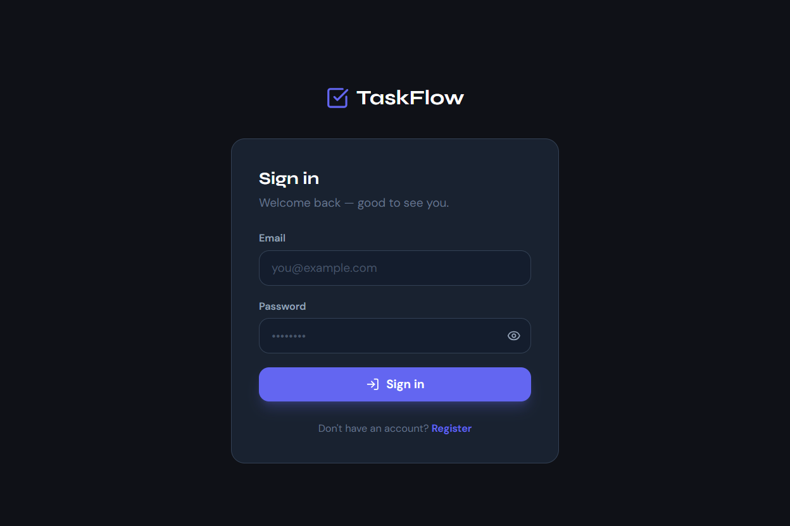
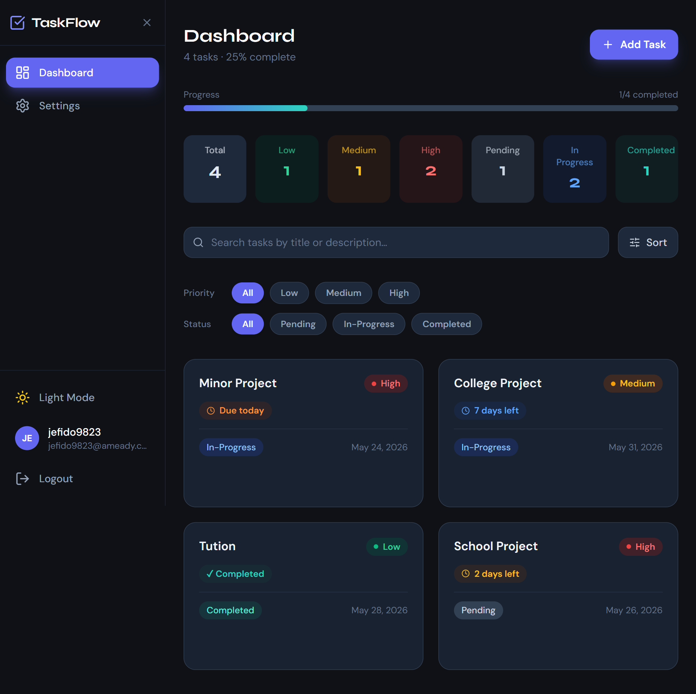
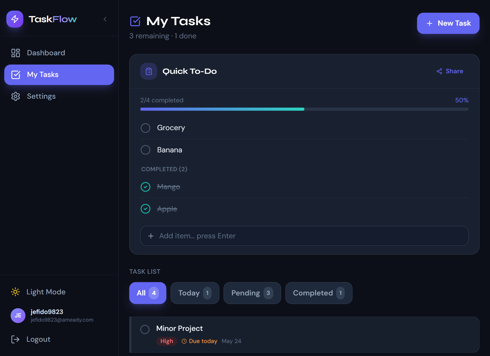
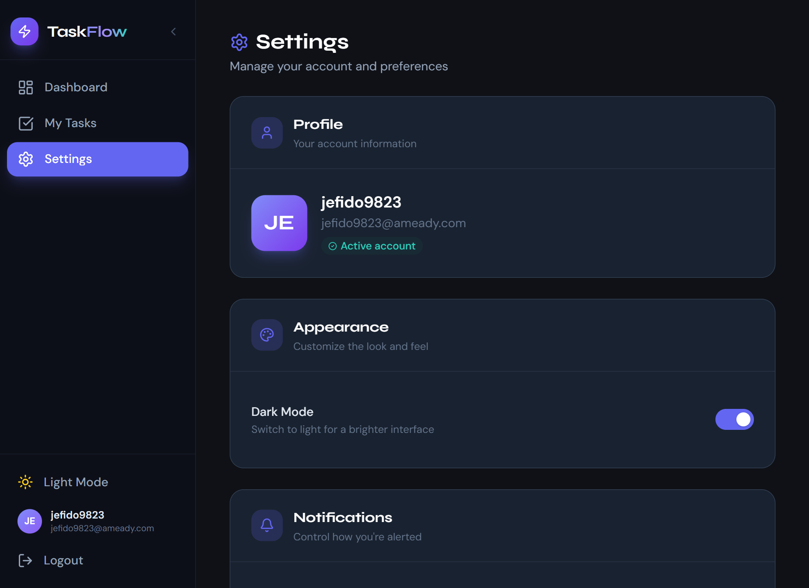
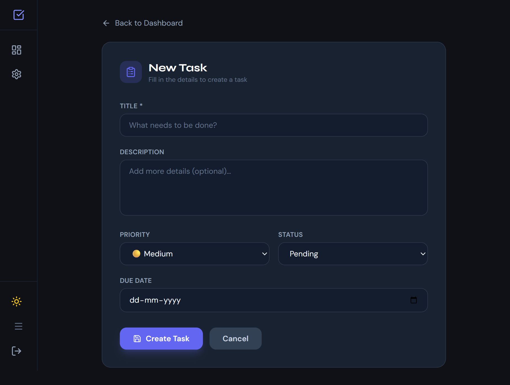
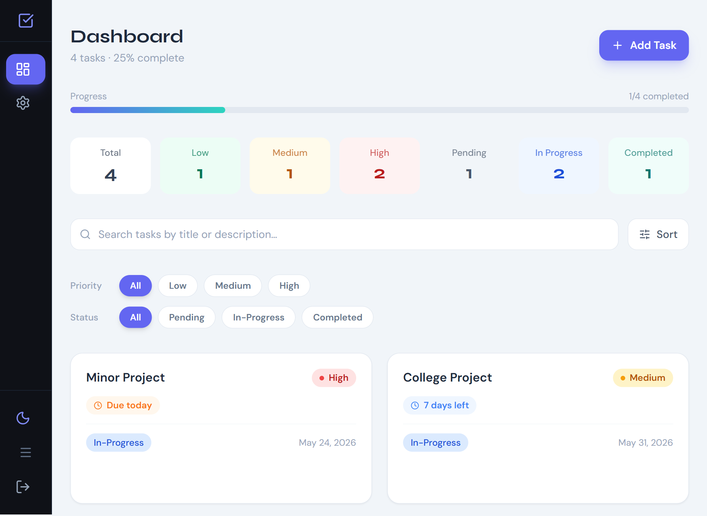

<p align="center">
  
</p>

<!-- <p align="center">
  
</p> -->

<p align="center">
  
</p>

<p align="center">
  
  
  
  
  
  
</p>

## ✨ Features

<table align="center">
<tr>
<td align="center">📋 Smart Task Management</td>
<td align="center">🌗 Dark / Light Mode</td>
<td align="center">📱 Fully Responsive UI</td>
</tr>

<tr>
<td align="center">🔐 JWT Authentication</td>
<td align="center">📊 Productivity Analytics</td>
<td align="center">⚡ Smooth Animations</td>
</tr>

<tr>
<td align="center">🧠 Modern Dashboard</td>
<td align="center">🗂️ Task Categories</td>
<td align="center">🚀 Fast Performance</td>
</tr>
</table>

---

<p align="center">
  
</p>

---

<div align="center">

### 🌟 Designed to Feel Like a Real SaaS Product

Minimal. Fast. Animated. Responsive.  
Built to impress recruiters and demonstrate full-stack engineering skills.

</div>

---
TaskFlow is a feature-rich task management platform built with the MERN-style stack using React, Node.js, Express, and SQLite.  
Designed with a modern UI/UX, responsive layouts, animations, JWT authentication, analytics-ready architecture, and productivity-focused features.
<p align="center">
  
</p>


## 📸 Screenshots

# Login Page

# Dashboard

# Quick To-Do

# Setting 

# Add Task 

# Lightmode 


---

## ✨ Features

### Core
- 🔐 **JWT Authentication** — Register, Login, secure token-based sessions
- ✅ **Full Task CRUD** — Create, read, update, delete tasks
- 🏷️ **Priority Labels** — Low, Medium, High with color coding
- 📊 **Status Tracking** — Pending → In Progress → Completed
- ⏰ **Time Remaining** — Live countdown: overdue / today / X days left
- 📅 **Due Dates** — Visual overdue warnings on cards

### UI/UX
- 🌙 **Dark / Light Mode** — Toggle with system preference detection
- 📱 **Fully Responsive** — Mobile, tablet, laptop, desktop
- ✨ **Smooth Animations** — Framer Motion throughout
- 💀 **Skeleton Loaders** — Professional loading states
- 🔔 **Toast Notifications** — Success, error, action feedback

### Productivity
- 📋 **Quick To-Do List** — Microsoft To Do style checklist (persisted locally)
- 🔍 **Search Tasks** — Instant search by title and description
- ↕️ **Sort Options** — Newest, Oldest, Due Date, Priority
- 🏷️ **Filter Pills** — Filter by priority and status simultaneously
- 📈 **Progress Bar** — Visual completion percentage
- 📊 **Stats Dashboard** — Total, Pending, In Progress, Completed, High Priority, Overdue

### Settings
- 🔒 **Change Password** — With strength indicator
- 🎨 **Theme Toggle** — Persistent dark/light preference
- 📥 **Export CSV** — Download all tasks as spreadsheet
- 🔔 **Browser Notifications** — Native OS push notifications

---

## 🛠 Tech Stack

| Layer | Technology |
|---|---|
| **Frontend** | React 18 + Vite |
| **Styling** | Tailwind CSS (class-based dark mode) |
| **Animations** | Framer Motion |
| **Icons** | Lucide React |
| **Routing** | React Router v6 |
| **HTTP Client** | Axios (with auth interceptor) |
| **Toast** | react-hot-toast |
| **Fonts** | DM Sans, Syne, DM Mono (Google Fonts) |
| **Backend** | Node.js + Express |
| **Database** | SQLite (better-sqlite3) |
| **Auth** | JWT (jsonwebtoken) + bcrypt |
| **Frontend Deploy** | Vercel |
| **Backend Deploy** | Render |

---

## 📁 Project Structure

```
taskflow/
├── frontend/                   # React + Vite app
│   ├── src/
│   │   ├── api/
│   │   │   └── axiosInstance.js       # Axios config + auth interceptor
│   │   ├── context/
│   │   │   ├── AuthContext.jsx        # JWT auth state management
│   │   │   └── ThemeContext.jsx       # Dark/light mode state
│   │   ├── components/
│   │   │   ├── Sidebar.jsx            # Responsive navigation
│   │   │   ├── TaskCard.jsx           # Dashboard task card
│   │   │   ├── PriorityBadge.jsx      # Color-coded priority pill
│   │   │   ├── EmptyState.jsx         # Empty list illustration
│   │   │   ├── QuickTodo.jsx           # Quick To-Do list
│   │   │   ├── Footer.jsx             # App footer with branding
│   │   │   └── ProtectedRoute.jsx     # Auth guard for routes
│   │   ├── pages/
│   │   │   ├── Login.jsx              # Sign in page
│   │   │   ├── Register.jsx           # Sign up page
│   │   │   ├── Dashboard.jsx          # Main overview page
│   │   │   ├── MyTasks.jsx            # List view + Quick To-Do
│   │   │   ├── AddTask.jsx            # Create / edit task form
│   │   │   └── Settings.jsx           # Account settings
│   │   ├── App.jsx                    # Root + routes
│   │   └── index.css                  # Global styles + Tailwind
│   ├── tailwind.config.js
│   └── vite.config.js
│
├── backend/                    # Express API
│   ├── routes/
│   │   ├── auth.js                    # /api/auth (login, register, change-password)
│   │   └── tasks.js                   # /api/tasks (CRUD)
│   ├── middleware/
│   │   └── authMiddleware.js          # JWT verification
│   ├── db/
│   │   └── database.js                # SQLite setup + schema init
│   └── server.js                      # Express entry point
│
└── README.md
```

---

## 🚀 Getting Started

### Prerequisites

- Node.js v18+
- npm v9+

### 1. Clone the repository

```bash
git clone https://github.com/ayushracherlawar-ai/taskflow-fullstack-app.git
cd taskflow-fullstack-app
```

### 2. Backend setup

```bash
cd backend
npm install
```

Create a `.env` file:

```env
JWT_SECRET=your_super_secret_key_here
PORT=5000
```

Start the backend:

```bash
node server.js
# or with auto-reload:
npx nodemon server.js
```

Backend runs at: `http://localhost:5000`

### 3. Frontend setup

```bash
cd ../frontend
npm install
```

Create a `.env` file:

```env
VITE_API_URL=http://localhost:5000/api
```

Start the frontend:

```bash
npm run dev
```

Frontend runs at: `http://localhost:5173`

---
# ▶️ Run Project

## Run Frontend + Backend Together

```bash
npm run dev
```

---

## Frontend Runs On

```bash
http://localhost:5173
```

## Backend Runs On

```bash
http://localhost:5000
```

---

## 🔌 API Reference

### Auth endpoints (`/api/auth`)

| Method | Route | Body | Description |
|---|---|---|---|
| `POST` | `/register` | `{ username, email, password }` | Create account → returns JWT |
| `POST` | `/login` | `{ email, password }` | Sign in → returns JWT + user |
| `PUT` | `/change-password` | `{ currentPassword, newPassword }` | Change password (auth required) |

### Task endpoints (`/api/tasks`) — all require `Authorization: Bearer <token>`

| Method | Route | Body | Description |
|---|---|---|---|
| `GET` | `/` | — | Get all tasks for current user |
| `POST` | `/` | `{ title, description?, priority, status, due_date? }` | Create task |
| `PUT` | `/:id` | `{ title, description?, priority, status, due_date? }` | Update task |
| `DELETE` | `/:id` | — | Delete task |

---

## 🗃 Database Schema

```sql
-- Users table
CREATE TABLE users (
  id            INTEGER PRIMARY KEY AUTOINCREMENT,
  username      TEXT UNIQUE NOT NULL,
  email         TEXT UNIQUE NOT NULL,
  password_hash TEXT NOT NULL,
  created_at    DATETIME DEFAULT CURRENT_TIMESTAMP
);

-- Tasks table
CREATE TABLE tasks (
  id          INTEGER PRIMARY KEY AUTOINCREMENT,
  title       TEXT NOT NULL,
  description TEXT,
  priority    TEXT CHECK(priority IN ('low', 'medium', 'high')) DEFAULT 'medium',
  status      TEXT CHECK(status IN ('pending', 'in-progress', 'completed')) DEFAULT 'pending',
  user_id     INTEGER NOT NULL REFERENCES users(id) ON DELETE CASCADE,
  due_date    DATE,
  created_at  DATETIME DEFAULT CURRENT_TIMESTAMP
);
```


---

## 📱 Responsive Breakpoints

| Breakpoint | Screen | Sidebar Behaviour |
|---|---|---|
| `< 768px` | Mobile | Hidden. Sticky top bar + slide-in drawer |
| `768–1279px` | Tablet / Laptop | Fixed left sidebar (expandable / icon-only) |
| `1280px+` | Desktop | Full sidebar with extra content breathing room |

---
# 🌙 Dark Mode

TaskFlow includes:
- System-aware theme detection
- Persistent theme storage
- Tailwind class-based dark mode
- Responsive UI across all devices
---
### QuickTodo (embedded in Dashboard + My Tasks)
- Microsoft To-Do style quick checklist
- Animated checkbox (whileTap scale)
- Line-through animation on complete
- Pending items listed first, completed section below
- Progress bar
- Share button
- Persisted in localStorage (`"taskflow_quick_todos"`)

---
## ✅ Features Implemented (Tier 1 + Upgrades)

| Feature | Status |
|---|---|
| JWT Register + Login | ✅ |
| Change Password (backend) | ✅ |
| Dark Mode (persisted, system-aware) | ✅ |
| Responsive Sidebar (desktop + mobile) | ✅ |
| Dashboard with stats | ✅ |
| Task CRUD (create, read, update, delete) | ✅ |
| Priority labels (low/medium/high) | ✅ |
| Status tracking (pending/in-progress/completed) | ✅ |
| Search tasks | ✅ |
| Sort tasks (4 options) | ✅ |
| Filter by priority + status | ✅ |
| Time remaining on tasks | ✅ |
| Overdue warning (ribbon + red border) | ✅ |
| Skeleton loaders | ✅ |
| Optimistic delete (rollback on error) | ✅ |
| Empty state (animated SVG + CTA) | ✅ |
| Completion progress bar | ✅ |
| Quick To-Do list (MS To Do style) | ✅ |
| My Tasks page (list view + checkbox toggle) | ✅ |
| Settings page (6 sections) | ✅ |
| Export tasks to CSV | ✅ |
| Browser notifications | ✅ |
| Footer with branding | ✅ |
| react-hot-toast notifications | ✅ |
| Framer Motion animations throughout | ✅ |

---

## 🔮 Planned / Future (Tier 2+)

| Feature | Notes |
|---|---|
| Analytics page | recharts: bar, pie, line charts — code exists but route removed |
| Kanban board | dnd-kit drag-drop between status columns |
| Tags/categories | Add `tags` column to SQLite, filter by tag |
| Task reminders (cron) | nodemailer + node-cron |
| GitHub Actions CI | `.github/workflows/ci.yml` |
| Rate limiting | express-rate-limit on auth routes |
| Keyboard shortcuts | N=add task, /=search, Esc=close |
| Confetti on completion | canvas-confetti |
| Focus mode | Today's tasks fullscreen |

---

# 🧠 Design Inspiration

Inspired by:
- Microsoft To Do
- Notion
- Linear

---


## 👨‍💻 Author

**Ayush Racherlawar**

> © 2026 TaskFlow. All Rights Reserved.

---

## 📄 License

This project is licensed under the [MIT License](LICENSE).
---
# ⭐ Support

If you liked this project:
- Star the repository ⭐
- Fork the project 🍴
- Share feedback 🚀
---
